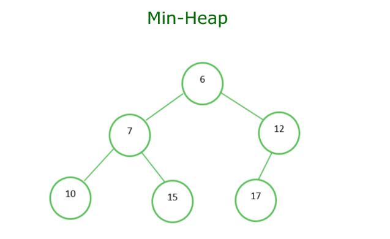
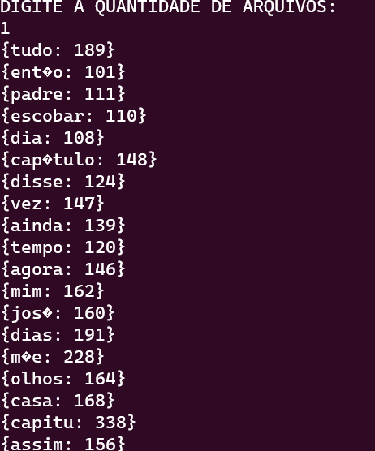
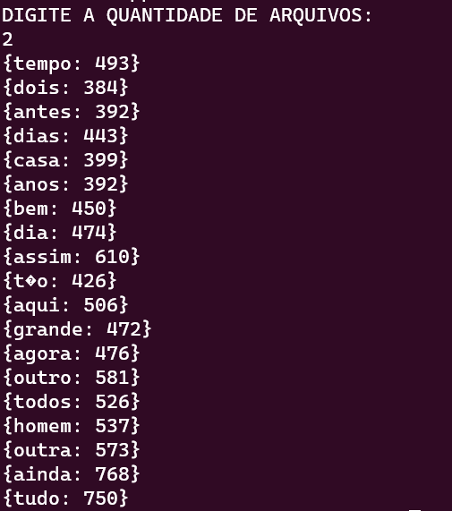

# Top K-Elementos

## Visão Geral do Problema 

O objetivo deste trabalho é achar as K palavras com mais aparições dentro de arquivos de texto. Para isso foram utilizadas estruturas bem conhecidas e adequadas a este problema, como a Tabela de dispersão (Hash) e o Heap. A Hash tem como função contar a frequência de cada palavra contida no texto, já o Heap possúi a função de manter o controle da organização das top K palavras mais valisas do arquivo de texto analisado. Essa implementação permite a analise de uma grande massa de dados, assim como as disponibilizadas, onde possúimos uma analise rápida e acertiva sobre quais são os K elementos mais valiosos do conjunto, K neste projeto é um número que pode ser alterado, por padrão de teste, K foi utilizado como 20, afim de ver uma boa quantia de elementos, porém ele pode ser subtraído ou incrementado. Esta implementação foi feita na linguagem de programação C++, tendo em vista que, ela possúi uma grande gama de funcionalidades já implementadas.

## Arquivos Utilizados na Execução do programa
* src
  * ```main.cpp```: Estrutura principal do código.
  * ```functions.hpp```: Declaração de funções e bibliotecas utilizadas. 
  * ```functions.cpp```: Implementação das funções do programa.
* Dataset
  * ```input1.data```: Arquivo com o input inicial do programa.
  * ```input2.data```: Arquivo com o input secundario do programa.
  * ```stopwords.txt```: Arquivo possuindo palavras a serem desconsideradas.

## Lógica de Implementação

De inicio criasse um ```unordered_set``` para armazenar as stopwords, através da biblioteca ```<fstream.h>``` é possível realizar a leitura do arquivo ```stopwords.txt```, aramazenando seu conteudo na variável  ```Hash_stopwords```. Já a leitura do arquivo de input principal, é feita caracter por carater, a cada iteração o caracter é concatenado na variável ```word``` em sua forma minúscula graças a função ```tolower()```,através de um ```switch()``` é analisado qual o carater que o programa está lendo, caso seja um caracter não alfabetico como um sinal de pontuação isso é indício que chegamos ao final de uma palavra, neste caso é chamada a função ```ADD_Main_Hash()``` onde a palavra será adicionada a Tabela de dispersão principal por armazenar a frequência dos itens, dentro da função já feita a verificação se a palavra analisada é uma stopword ou não, caso seja, a palavra não é adicionada. O processo de leitura tem apenas como objetivo armazenar a palavra e sua devida frequência. Após o processo inicial de armazenamento dos itens na "Hash" de frequência, é chamada a função ```init_Heap()``` com o objetivo de criar o nosso Heap que possuirá iniciamente K itens, K é um numero já determinado dentro do programa, porém pode ser alterado no arquivo ```Functions.hpp```, o valor utilizado nos teste foi de 20. Depois da criação do "Heap" inicial começamos a operá-lo, o "Heap" criado é um "Mínimo Heap":

<br>
Exemplo de Mininimo Heap.

sua característica principal é deixar seu menor elemento na sua raíz, sendo assim, para atualizar o Heap a cada comparação é necessário analisar se a palavra apareceu mais vezes que a palavra que está na posição "[0]" do Heap atual.

## Decisões de Implementação

Para esse programa foram utilizadas um ampla gama de estruturas e funções da Biblioteca padrão do C++ (STL), Como o ```vector```, ```unordered_map``` e ```unordered_set``` para armazenamento dos itens analizados ,e funções como ```make_heap()```, ```pop_heap()``` para o devido processamento destes mesmos itens. A classe ```Utils``` declarada no arquivo ```Functions.hpp```, possui como atributos um ```unordered_set``` para aramazenamento das stopwords, um ```unordered_map``` para armazenamento das palavras a serem processadas e um ```vector``` que será onde as palavras serão processadas a fim da criação de um Heap classificado pelo número de aparição das mesmas.


### leitura de Arquivos
Um importante passo que foi tomado, foi a respeito do tratamento de palavras acentuadas, uma vez que os arquivos analisados estão codificados em ASCII, Para isso foi utilizada a codificação UTF-8. Outra medida tomada foi fazer uso da função ```tolower()```, já que para fim de comparação o mesmo caractere minúsculo pode ser considerado diferente que sua forma maiúscula, fazendo palavras iguais serem consideradas diferentes para o programa, essa função transforma o caracter de maiúsculo para minúsculo, padronizando a leitura das palavras. Para a leitura do arquivo de input principal foi utilizada uma forma já feita em um trabalho anterior (<a href="https://github.com/frankleitelemoscosta/Writing-aid-system"> Writing-aid-system</a>  ), onde o texto é salvado em uma variável <strong>char</strong>, esse metodo trás como uma vantagem a velocidade de processamento, algo importante para arquivos com grandes conteúdos, porém é algo que demanda bastante espaço na memória sendo essa uma desvantagem. A leitura do arquivo das stopwords foi feita de uma maneira diferente, foi ultilizada uma leitura diretamente do arquivo para a variável, decisão que pode afetar na velocidade, já que esse processo é mais demorado comparado a o outro previamente apresentado, porém não há tanto risco de ocorrer o problema de armazenamento insuficiente.

## Principais Estruturas e Funções Utilizadas
### Estruturas
#### Unordered_map
O unordered_map faz parte da biblioteca padrão do C++ (STL) como foi dito no inicio, ele faz uma implementação de uma estrura conhecida como tabela de dispersão (Hash), esta possui como caracteristica principal ser uma coleção de elementos que possuem o seguinte conjunto: chave-valor, a chave é única e serve para mapear o valor correspondente a devida chave. No trabalho foi utilizada para mapear as palavras e suas ocorrências, a chave neste contexto foram as palavras e os valores são as frequências das respectivas palavras. O uso desta estrutura foi crucial para o sucesso do trabalho, já que facilita bastante o processo de verificação se uma palavra já foi armazenada ou não, uma vez que o tempo de pesquisa e inserção em um unordered_map é constante <b>O(1)</b>. 
#### Unordered_set
O unordered_set é análogo ao unordered_map, no quesito de ser uma implementação de uma tabela hash, porém ele se caracteriza por armazenar elementos únicos, se assemelhando a um conjunto na área da matematica por exemplo, em caso de inserção de um elemento que já existe , a inserção não é feita. Essa estrutura foi bastante útil para armazenamento das stopwords, uma vez que, são palavras únicas sua caracteristica foi bem útil. Em conjunto com o unordered_set, na função de inserção na Hash de frequência (```ADD_Main_Hash()```), a função ````.find()`` foi usada para pesquisar se a palavra era ou não uma stopword, o custo desta pesquisa é  <b>O(1)</b>, esta funcionalidade retorna o índice que a palavra foi encontrado, no caso, a chave.
### Funções
#### make_heap()
A função make_heap(), tem como objetivo transformar um intervalo de elementos em um Heap, por padrão ela cria um Max-Heap, onde cada elemento pai possui um número maior que seu elemento filho e o maior elemento está em sua raiz (índice 0 do vector), essa estrutura se baseia em uma árvore binária com relação a sua estruturação e caminhamento. A função executa o "Heapify", onde há uma simples análise se o valor do nó pai é maior que o valor que o nó filho, caso não seja, há uma troca, esse processo é realizado várias vezes até que a condição magna de cada nó pai ser maior que o nó filho seja valida para todo o intervalo. O custo desta função é linear ao número 'N' de valores que o intervalo possúi: <b>O(N)</b>
#### push_heap()
O push_heap(), objetiva adicionar um item ao heap, sem quebrar suas propriedades. Ele se utiliza da operação "sift up", para manter a ordem do Heap. Esta operação se baseia em:
* insere-se o novo elemento no final do heap.
* Comparação e Troca: Em seguida, o novo elemento é comparado com seu pai. Se o novo elemento for maior (em um max-heap) ou menor (em um min-heap) que seu pai, ocorre uma troca entre o novo elemento e seu pai.


O objetivo é fazer com que o elemento flutue na árvore até achar uma posição que a propriedade do Heap se mantenha, esse processo se repete até essa condição de parada. O custo desta função é <b>O(log N)</b>, com N sendo o número de elementos presentes no Heap.
#### pop_heap()
O pop_heap(), assim como, o push_heap() tem como objetivo operar o Heap mas mantendo suas propriedades, o pop_heap() tem o objetivo de remover a raiz do heap. Ele realiza a operação de "sift down" no intervalo de elementos que deseja, o sift down se baseia em:
*  Primeiro, após remover o elemento do topo do heap, o último elemento do heap é colocado na posição do topo.
* O elemento que foi movido para a posição do topo é comparado com seus filhos. No caso de um max-heap, ele é comparado com seus filhos para verificar qual filho é o maior.
* Se o elemento for maior (em um max-heap) ou menor (em um min-heap) do que o filho adequado, ocorre uma troca entre o elemento e o filho correspondente. Isso é feito para que o elemento "desça" na árvore até que ele esteja em uma posição onde a propriedade do heap seja mantida.


Essa operação é repetida de comparação e troca, até o elemento estar posicionado de maneira correta no Heap. O custo desta função é <b>O(log N)</b>, com N sendo o numero de elementos no intervalo desejado.


## Análise de Resultados
São utilizados 2 arquivos de input, ```input1.data``` e ```input2.data```, as K palavras mais importantes quando são selecionados para ler os 2 arquivos são somadas entre sí.


<br>
Input com o primeiro arquivo.


<br>
Input com o segundo arquivo.

## Conclusões

O trabalho cumpriu os objetivos de: armazenamento de uma grande massa de dados, utilização eficiente das estruturas estabelecidas, e processamento de uma grande massa de dados com o auxilio das estruturas. As estruturas como: ```unordered_map```,```unordered_set```, ```vector``` se provaram bastante eficientes no processamento dos dados coletados, as funções utilizadas também cumpriram suas funções bem, sem serem muito custosas para a maquina de teste, uma vez que os custos de uso das funções de push,pop,make -Heap sempre trabalham em um custo Logartimo ao Linear, sempre se mantendo nessa faixa, oquê é algo excelente. Contudo dito, o clássico problema de selecionar os Top K-itens de um conjunto é facilmente contornado pelo uso de estruturas previamente estabelecidas, sendo utilizadas em conjunto (Tabela de dispersão(Hash) e Heap). 


## Referências

* DROZDEK, ADAM . Estrutura de Dados E Algoritmos Em C++. 2016. 4 edição ed., Cengage Learning Edições Ltda, 2017, pp. 474 475.
* https://cplusplus.com/reference/algorithm/make_heap/?kw=make_heap
* https://cplusplus.com/reference/algorithm/pop_heap/
* https://cplusplus.com/reference/algorithm/push_heap/?kw=push_heap
* https://cplusplus.com/reference/unordered_set/unordered_set/find/


## Compilação e Execução
<p>
    <i>Este código possui um arquivo Makefile que facilita a compilação e execução do programa</br>As diretrizes de execução deste
    Make file são:<i>
    <table border="1">
      <tr><td><u>make clean</u></td> <td>Apaga a última compilação realizada contida na pasta build</td></tr>
      <tr><td><u>make</u></td> <td>Executa a compilação do programa utilizando o gcc, e o resultado vai para a pasta build.</td></tr>
      <tr><td><u>make run</u></td> <td>Executa o programa da pasta build após o programa já estar compilado </td></tr>
    </table>
    <i>Para a execução do programa utilize <u>make</u> para realizar a compilação e logo após utilize <u>make run</u> para executar o programa</i>
</p>

# Autor
E-mail: joaopedrofdpd2205@gmail.com</br>
3° Período-2023-Engenharia de Computação-CEFET-MG
